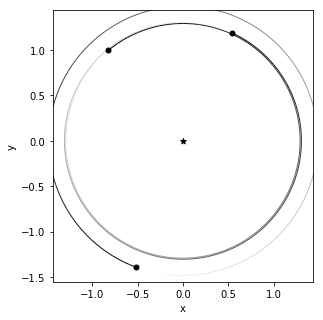
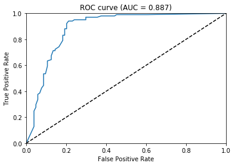
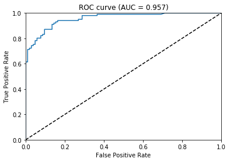
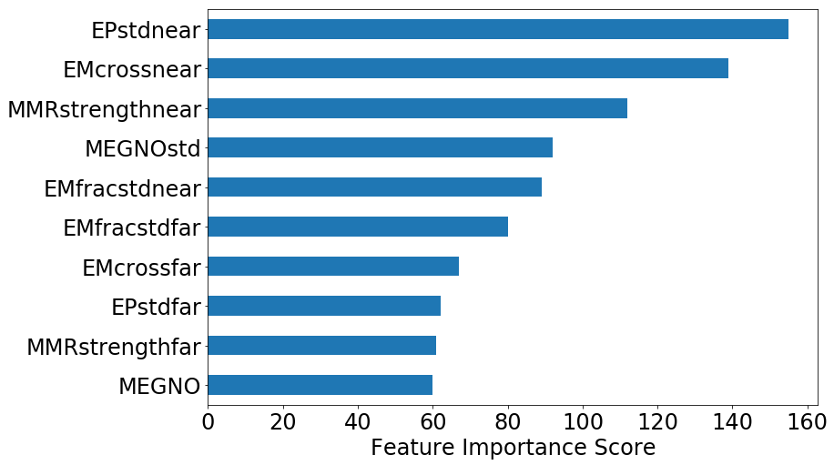
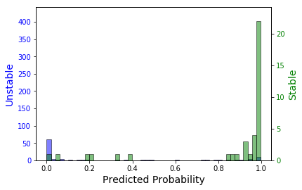
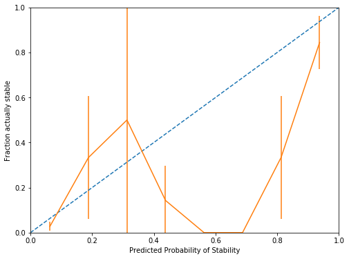

```python
import numpy as np
import numpy.random as rd
import os
import matplotlib.pyplot as plt
%matplotlib inline
import pandas as pd
from sklearn import metrics
import xgboost as xgb
from xgboost.sklearn import XGBClassifier
from hyperopt import hp, fmin, tpe, STATUS_OK, Trials
import hyperopt
import dill
import sys
sys.path.append('../Dan_research/spock')
from spock.modelfitting import train_test_split, ROC_curve, stable_unstable_hist, calibration_plot, unstable_error_fraction
from spock.feature_functions import features
import rebound
import dask.dataframe as dd
from multiprocessing import Pool

n_workers=os.cpu_count()
```


```python
os.system("jupyter nbconvert --to markdown Tutorial.ipynb");
```

# Generating fake systems


```python
seconds_p_day = 86400
days_p_year = 365.25
meters_p_AU = 149597870700
earth_mass_p_solar_mass = 333000
year_p_reboundtime = 1 / (2 * np.pi)
AU_p_RS = 0.00465047

def replace_snapshot(sim, filename):
    if os.path.isfile(filename):
        os.remove(filename)
    sim.simulationarchive_snapshot(filename)
    
def loguniform(low=0.001, high=1, size=None):
    return np.exp(rd.uniform(np.log(low), np.log(high), size))

def max_e_inner(a_in, a_out, e_out=0):
    return a_out / a_in * (1 - e_out) - 1

def max_e_outer(a_out, a_in, e_in=0):
    return 1 - a_in / a_out * (1 + e_in)

def min_es(ms, As):
    Nplanets = len(ms)
    e_mins = np.zeros(Nplanets)
    for i in range(Nplanets):
        e_mins[i] = As[i] ** 2
        inner_sum = 0
        for j in range(Nplanets):
            if i != j:
                inner_sum += (ms[j] / np.max([As[i], As[j]]) ** 2) ** 2
        e_mins[i] *= np.sqrt(inner_sum)
    return e_mins

def check_es(a0, e0, a1, e1, a2, e2):
    return (e0 <= max_e_inner(a0, a1, e1)) and (e1 <= max_e_inner(a1, a2, e2)) and (e1 <= max_e_outer(a1, a0, e0)) and (e2 <= max_e_outer(a2, a1, e1))


def collision(reb_sim, col):
    reb_sim.contents._status = 5
    return 0


"""
Generating random systems
Using methodolgy similar to Tamayo et al. 2020 (in prep)
"""
def generate_system():
    Mstar = 1
    mutual_hill_radii_sep = rd.uniform(0, 40, 2)
    incs = rd.uniform(1e-3, 1e-1, 3)  # inclinations (radians)
    Ws = 2 * np.pi * rd.rand(3)  # longitude of ascending node (radians)
    ws = 2 * np.pi * rd.rand(3)  # pericenter orientation (radians)
    Ms = 2 * np.pi * rd.rand(3)  # initial orbital phase (radians)
    ms = loguniform(1e-7, 1e-4, 3)  # mass ratios of planets to star, from ~1/3 Mars to ~2x Neptune 
    
    As = np.ones(3)
    As[0] = rd.uniform(low=0.5, high=1.5)  # first planet is 0.5 to 1.5 AU from central star
    for i in range(1,3):  # the other semi major axes are chosen by a mutual radii separation of 0-30
        shared_quant = np.cbrt(9 * (ms[i-1] + ms[i]) / Mstar) * mutual_hill_radii_sep[i-1]
        As[i] = As[i-1] * (6 + shared_quant) / (6 - shared_quant)
    
    radii = As * np.cbrt(ms[i] / Mstar / 3)
        
    es = np.array([0,0,0])
    bad_es = True
    e0_max = np.min([max_e_inner(As[0], As[1]), 1])
    e1_max = np.min([np.minimum(max_e_inner(As[1], As[2], es[2]), max_e_outer(As[1], As[0])), 1]) # ~0.15
    e2_max = np.min([max_e_outer(As[2], As[1]), 1])
    e_mins = min_es(ms, As)
    while bad_es:
        es = np.array([loguniform(e_mins[0], e0_max), loguniform(e_mins[1], e1_max), loguniform(e_mins[2], e2_max)])
        bad_es = not check_es(As[0], es[0], As[1], es[1], As[2], es[2])

    sim = rebound.Simulation()
    sim.add(m=1.)
#     print(ms, As, es, Ws, ws, Ms, incs)
    for i in range(3):
        sim.add(m=ms[i], a=As[i], e=es[i], Omega=Ws[i], omega=ws[i], M=Ms[i], inc=incs[i], r=radii[i])
    sim.move_to_com()
    
    sim.collision = 'line'
    sim.collision_resolve = collision
    sim.ri_whfast.keep_unsynchronized = 1
    sim.ri_whfast.safe_mode = 0
    
    sim.integrator = "whfast"
    sim.dt = np.sqrt(2) / 20 * sim.particles[1].P
        
    return sim
```


```python
sim_names = "new_sims/"
n = 1024
sa_names = [("id_%5.0d.bin"%i).replace(" ","0") for i in range(n)]

# for i in range(n):
#     sim = generate_system()
#     replace_snapshot(sim, sim_names + sa_names[i])
```


```python
sim = rebound.SimulationArchive(sim_names + sa_names[0])[0]
print([sim.particles[1+i].P for i in range(3)])
print([sim.particles[1+i].r for i in range(3)])
# print(features(sim, features_args))
rebound.OrbitPlot(sim)
```

    /storage/home/cjg66/miniconda3/lib/python3.7/site-packages/rebound/simulationarchive.py:132: RuntimeWarning: You have to reset function pointers after creating a reb_simulation struct with a binary file.
      warnings.warn(message, RuntimeWarning)


    [9.236279635514508, 9.37156174997462, 11.379964740314742]
    [0.01669623291109905, 0.016858871869785186, 0.019188840905719342]


    (<Figure size 360x360 with 1 Axes>,
     <matplotlib.axes._subplots.AxesSubplot at 0x7fe3dc87cb10>)





# Calculating features


```python
Norbits = 1e4
Nout = 80
trios = [[i,i+1,i+2] for i in range(1,sim.N_real-2)]
features_args = [Norbits, Nout] + [trios]

def calculate_features(row):
    res, stable = features(rebound.SimulationArchive(sim_names + "sims/" + row["sim"])[0], features_args)
    r = res[0]
    return pd.Series(r, index=list(r.keys()))
```


```python
# %%time
df = pd.DataFrame(data=sa_names, columns=["sim"])
ddf = dd.from_pandas(df, npartitions=n_workers)
testres = calculate_features(df.loc[0])
metadf = pd.DataFrame([testres])
# feats = ddf.apply(calculate_features, axis=1, meta=metadf).compute(scheduler='processes')
# feats.to_csv(sim_names + "trainingdata.csv")
feats = pd.read_csv(sim_names + "trainingdata.csv", index_col=0)
```

    /storage/home/cjg66/miniconda3/lib/python3.7/site-packages/rebound/simulationarchive.py:132: RuntimeWarning: You have to reset function pointers after creating a reb_simulation struct with a binary file.
      warnings.warn(message, RuntimeWarning)


    ---------------------------------------------------------------------------

    TypeError                                 Traceback (most recent call last)

    <ipython-input-48-e77c978b1e02> in <module>
          2 df = pd.DataFrame(data=sa_names, columns=["sim"])
          3 ddf = dd.from_pandas(df, npartitions=n_workers)
    ----> 4 testres = calculate_features(df.loc[0])
          5 metadf = pd.DataFrame([testres])
          6 # feats = ddf.apply(calculate_features, axis=1, meta=metadf).compute(scheduler='processes')


    <ipython-input-47-609b727e2d84> in calculate_features(row)
          5 
          6 def calculate_features(row):
    ----> 7     res, stable = features(rebound.SimulationArchive(sim_names + "sims/" + row["sim"])[0], features_args)
          8     r = res[0]
          9     return pd.Series(r, index=list(r.keys()))


    TypeError: 'list' object is not callable


```python
# # %%time
# # hmm = pd.DataFrame(features(rebound.SimulationArchive(sim_names + sa_names[0])[0], features_args)[0])
# # for i in range(1,10):
# #     hmm = hmm.append(pd.DataFrame(ff.features(rebound.SimulationArchive(sim_names + sa_names[i])[0], features_args)[0]), ignore_index=True)
# # hmm["sim"] = sa_names[:10]
```

# Are systems truly stable?


```python
def system_stable(nsim):
    sim = rebound.SimulationArchive(sim_names + sa_names[nsim])[0]
    P1 = sim.particles[1].P
    try:
        sim.integrate(1e6 * P1, exact_finish_time=0)
        return True
    except:
        return False
```


```python
# %%time
# system_stable(1)
```

    /storage/home/cjg66/miniconda3/lib/python3.7/site-packages/rebound/simulationarchive.py:132: RuntimeWarning: You have to reset function pointers after creating a reb_simulation struct with a binary file.
      warnings.warn(message, RuntimeWarning)


    CPU times: user 15.4 s, sys: 10 ms, total: 15.4 s
    Wall time: 15.3 s


    True


```python
# %%time
# pool = Pool(processes=n_workers)
# nsim_list = np.arange(0, n)
# res = pool.map(system_stable, nsim_list)
# df = pd.DataFrame(data=sa_names, columns=["sim"])
# df["stability"] = res
# df.to_csv("sim_names + "labels.csv")
```

    CPU times: user 6.93 s, sys: 1.49 s, total: 8.43 s
    Wall time: 24min 16s


```python
# stab = np.array(np.ones(n), dtype=bool)
# for i in range(n):
#     try:
#         stab[i] = pd.read_csv(sim_names + "sims/" + sa_names[i] + "_stab.csv", index_col=0)["stability"][0]
#     except:
#         continue
# df = pd.DataFrame(data=sa_names, columns=["sim"])
# df["Stable"] = stab
# df.to_csv(sim_names + "labels.csv")
stab = pd.read_csv(sim_names + "labels.csv", index_col=0)
# stab
```

# Training models!

## MEGNO


```python
# datapath = '../Dan_research/spock/training_data/'
# dset = 'resonant/'
# Norbits = 1e4
# Nout = 80
featureargs = (Norbits, Nout) # params to pass feature function
# featurefolder = 'additional_featuresNorbits{0:.1f}Nout{1}trio/'.format(Norbits, Nout)
# trainingdatafolder = datapath+dset+featurefolder
datapath = sim_names
featurefolder = sim_names
trainingdatafolder = sim_names
```


```python
space ={
        'max_depth': hp.randint('x_max_depth',  20),
        'min_child_weight': hp.quniform ('x_min_child', 1, 10, 1),
        'subsample': hp.uniform ('x_subsample', 0.8, 1),
        'scale_pos_weight': hp.uniform("x_pos_weight", 1, 50),
        "learning_rate":hp.uniform("x_learning_rate",0.01,0.2),
        'colsample_bytree': hp.uniform ('x_tree_colsample', 0.5,1),
}

def objective(params):
    clf = XGBClassifier(n_estimators = 100,
                            max_depth = params['max_depth'], 
                            min_child_weight = params['min_child_weight'],
                            subsample = params['subsample'],
                            colsample_bytree = params['colsample_bytree'],
                            learning_rate = params['learning_rate'], seed = 0)
    
    score = xgb.cv(clf.get_xgb_params(), dtrain, nfold = 5, metrics = "auc", early_stopping_rounds=10)
    avg_score =  np.mean(score["test-auc-mean"])
    error = np.mean(score["test-auc-std"])
    
    print("SCORE:", avg_score, "ERROR", error)#, "HOLDOUT SCORE", test_score)
    return{'loss':1-avg_score, 'status': STATUS_OK, "cv_score":avg_score , "cv_error":error}
```


```python
features = ['MEGNO']

trainX, trainY, testX, testY = train_test_split(trainingdatafolder, features, filter=False)

dtrain = xgb.DMatrix(trainX, trainY)
dtest = xgb.DMatrix(testX, testY)
```


```python
%%time
trials = Trials()
import time
start = time.time()
best = fmin(fn=objective, space = space, algo = tpe.suggest, max_evals = 50, trials = trials, rstate=np.random.RandomState(seed=0))
end = time.time()
print("Optimization Time: %f seconds", (end  -start))
```

    SCORE:                                                
    0.88824576                                            
    ERROR                                                 
    0.02383992815223841                                   
    SCORE:                                                
    0.88539166                                                              
    ERROR                                                                   
    0.02321627987623114                                                     
    SCORE:                                                                  
    0.87202202                                                              
    ERROR                                                                   
    0.026597761760685568                                                    
    SCORE:                                                                  
    0.8865834400000001                                                      
    ERROR                                                                   
    0.025793955788869876                                                    
    SCORE:                                                                  
    0.8840826999999999                                                      
    ERROR                                                                   
    0.02618025101661655                                                     
    SCORE:                                                                  
    0.8862435399999999                                                      
    ERROR                                                                   
    0.023128680379504798                                                    
    SCORE:                                                                  
    0.8856513399999999                                                      
    ERROR                                                                   
    0.026058213901558637                                                    
    SCORE:                                                                  
    0.5                                                                     
    ERROR                                                                   
    0.0                                                                     
    SCORE:                                                                  
    0.8882566000000001                                                      
    ERROR                                                                   
    0.02364346383593734                                                     
    SCORE:                                                                  
    0.8834615800000002                                                               
    ERROR                                                                            
    0.023553880681968686                                                             
    SCORE:                                                                            
    0.88277468                                                                        
    ERROR                                                                             
    0.023290329527950824                                                              
    SCORE:                                                                            
    0.8748236799999999                                                                
    ERROR                                                                             
    0.027436885232011383                                                              
    SCORE:                                                                            
    0.88371516                                                                        
    ERROR                                                                             
    0.02536406406219689                                                               
    SCORE:                                                                            
    0.88363694                                                                        
    ERROR                                                                             
    0.02544726662273495                                                               
    SCORE:                                                                            
    0.88417992                                                                        
    ERROR                                                                             
    0.024184976113806083                                                              
    SCORE:                                                                            
    0.8853200400000001                                                                
    ERROR                                                                             
    0.024920020024029564                                                              
    SCORE:                                                                            
    0.8891906                                                                         
    ERROR                                                                             
    0.022472300659138984                                                              
    SCORE:                                                                            
    0.8830184400000001                                                                
    ERROR                                                                             
    0.02313227430765546                                                               
    SCORE:                                                                            
    0.88345046                                                                        
    ERROR                                                                             
    0.026182064449403585                                                              
    SCORE:                                                                            
    0.8880779999999999                                                                
    ERROR                                                                             
    0.022321233360014386                                                              
    SCORE:                                                                            
    0.8881979                                                                         
    ERROR                                                                             
    0.022085705359754747                                                              
    SCORE:                                                                            
    0.88695034                                                                        
    ERROR                                                                             
    0.025177843945050238                                                              
    SCORE:                                                                            
    0.8898357399999999                                                                
    ERROR                                                                             
    0.023295605668952536                                                              
    SCORE:                                                                            
    0.8917614199999999                                                                
    ERROR                                                                             
    0.02391726248058393                                                               
    SCORE:                                                                            
    0.8918620200000001                                                                
    ERROR                                                                             
    0.021850775224270334                                                              
    SCORE:                                                                            
    0.8912487800000001                                                                
    ERROR                                                                             
    0.02365890009550776                                                               
    SCORE:                                                                            
    0.8935677400000002                                                                
    ERROR                                                                             
    0.022709611980989745                                                              
    SCORE:                                                                            
    0.8903843800000001                                                                
    ERROR                                                                             
    0.02582086590768079                                                               
    SCORE:                                                                            
    0.8903333799999998                                                                
    ERROR                                                                             
    0.021502534641885937                                                              
    SCORE:                                                                            
    0.89138352                                                                        
    ERROR                                                                             
    0.0198483432518073                                                                
    SCORE:                                                                            
    0.88887914                                                                        
    ERROR                                                                             
    0.024933011786146674                                                              
    SCORE:                                                                            
    0.8899806800000002                                                                
    ERROR                                                                             
    0.027764167509407467                                                              
    SCORE:                                                                            
    0.88888236                                                                        
    ERROR                                                                             
    0.02073195136751783                                                               
    SCORE:                                                                            
    0.8854851400000001                                                                
    ERROR                                                                             
    0.024712678046615612                                                              
    SCORE:                                                                            
    0.88548744                                                                        
    ERROR                                                                             
    0.02638280685578519                                                               
    SCORE:                                                                            
    0.8888581199999999                                                                
    ERROR                                                                             
    0.02160065263245866                                                               
    SCORE:                                                                            
    0.88527424                                                                        
    ERROR                                                                             
    0.02579467528944588                                                               
    SCORE:                                                                            
    0.8852573199999998                                                                
    ERROR                                                                             
    0.02257511936923146                                                               
    SCORE:                                                                            
    0.5                                                                               
    ERROR                                                                             
    0.0                                                                               
    SCORE:                                                                            
    0.8886289999999999                                                                
    ERROR                                                                             
    0.026887665310842745                                                              
    SCORE:                                                                            
    0.88888926                                                                        
    ERROR                                                                             
    0.024252904613097693                                                              
    SCORE:                                                                            
    0.8862549                                                                         
    ERROR                                                                             
    0.02673701721924431                                                               
    SCORE:                                                                            
    0.8760137799999999                                                                
    ERROR                                                                             
    0.02823858617673706                                                               
    SCORE:                                                                            
    0.8884875799999999                                                                
    ERROR                                                                             
    0.020282240478268748                                                              
    SCORE:                                                                            
    0.8875368800000001                                                                
    ERROR                                                                             
    0.024872797785137297                                                              
    SCORE:                                                                            
    0.8901913200000001                                                                
    ERROR                                                                             
    0.022926731327067698                                                              
    SCORE:                                                                            
    0.89079178                                                                        
    ERROR                                                                             
    0.020296311758128953                                                              
    SCORE:                                                                            
    0.88693288                                                                        
    ERROR                                                                             
    0.024029004390841248                                                              
    SCORE:                                                                            
    0.8848640600000002                                                                
    ERROR                                                                             
    0.026821226099756446                                                              
    SCORE:                                                                            
    0.89015772                                                                        
    ERROR                                                                             
    0.024206155630564545                                                              
    100%|██████████| 50/50 [00:04<00:00, 12.05trial/s, best loss: 0.10643225999999983]
    Optimization Time: %f seconds 4.127461194992065
    CPU times: user 3.54 s, sys: 220 ms, total: 3.76 s
    Wall time: 4.13 s


```python
best
```


    {'x_learning_rate': 0.09846322775310665,
     'x_max_depth': 5,
     'x_min_child': 2.0,
     'x_pos_weight': 7.8575876782609715,
     'x_subsample': 0.9806958528688635,
     'x_tree_colsample': 0.8703651258790678}


```python
model = XGBClassifier(n_estimators=100, scale_pos_weight=best["x_pos_weight"],
                         learning_rate = best["x_learning_rate"], 
                         max_depth = int(best["x_max_depth"]), 
                         min_child_weight = best["x_min_child"],
                         subsample = best["x_subsample"], 
                         colsample_bytree = best["x_tree_colsample"])

score = xgb.cv(model.get_xgb_params(), dtrain, nfold = 5, metrics = "auc", verbose_eval=True, num_boost_round=10)
model.fit(trainX, trainY)
```

    [0]	train-auc:0.894697+0.00566713	test-auc:0.883202+0.0278597
    [1]	train-auc:0.895558+0.00508818	test-auc:0.883249+0.0278737
    [2]	train-auc:0.89613+0.00495532	test-auc:0.883295+0.0279026
    [3]	train-auc:0.896445+0.00545399	test-auc:0.883264+0.027883
    [4]	train-auc:0.896455+0.00544859	test-auc:0.883265+0.027884
    [5]	train-auc:0.897766+0.00675998	test-auc:0.884588+0.0252732
    [6]	train-auc:0.89823+0.00641073	test-auc:0.886748+0.0257494
    [7]	train-auc:0.898997+0.00572086	test-auc:0.889596+0.0275126
    [8]	train-auc:0.899028+0.00570791	test-auc:0.889596+0.0275126
    [9]	train-auc:0.900431+0.00519606	test-auc:0.891066+0.0284377


    XGBClassifier(base_score=0.5, booster='gbtree', colsample_bylevel=1,
                  colsample_bynode=1, colsample_bytree=0.8703651258790678, gamma=0,
                  learning_rate=0.09846322775310665, max_delta_step=0, max_depth=5,
                  min_child_weight=2.0, missing=None, n_estimators=100, n_jobs=1,
                  nthread=None, objective='binary:logistic', random_state=0,
                  reg_alpha=0, reg_lambda=1, scale_pos_weight=7.8575876782609715,
                  seed=None, silent=None, subsample=0.9806958528688635,
                  verbosity=1)


```python
model.save_model(trainingdatafolder+'/models/megno.bin')

dill.dump([model, features, featureargs, featurefolder], open(trainingdatafolder + "/models/megno.pkl", "wb"))
```


```python
roc_auc, fpr, tpr, ROCthresholds = ROC_curve(trainingdatafolder, model, features)

fig, ax = plt.subplots()
ax.plot(fpr, tpr)
ax.plot([0, 1], [0, 1], 'k--')
ax.set_xlim([0.0, 1.0])
ax.set_ylim([0.0, 1.0])
ax.set_xlabel('False Positive Rate')
ax.set_ylabel('True Positive Rate')
ax.set_title('ROC curve (AUC = {0:.3f})'.format(roc_auc))
```


    Text(0.5, 1.0, 'ROC curve (AUC = 0.887)')





```python
model, features, featureargs, featurefolder = dill.load(open(trainingdatafolder + '/models/megno.pkl', 'rb'))
```


```python
for i in range(0,len(tpr), 15):
    print("Threshold {0}, TPR = {1}, FPR = {2}".format(ROCthresholds[i], tpr[i], fpr[i]))
```

    Threshold 1.99420964717865, TPR = 0.0, FPR = 0.0
    Threshold 0.9792628884315491, TPR = 0.5346534653465347, FPR = 0.09615384615384616
    Threshold 0.9719792008399963, TPR = 0.8316831683168316, FPR = 0.19230769230769232
    Threshold 0.35508063435554504, TPR = 0.9702970297029703, FPR = 0.3557692307692308


## AMD and Hill soon


```python
features = ['AMDtriofracnear', 'AMDtriofracfar']
features = ['betanear', 'betafar']
```

## Full


```python
space ={
        'max_depth': hp.randint('x_max_depth',  20),
        'min_child_weight': hp.quniform ('x_min_child', 1, 10, 1),
        'subsample': hp.uniform ('x_subsample', 0.8, 1),
        'scale_pos_weight': hp.uniform("x_pos_weight", 1, 50),
        "learning_rate":hp.uniform("x_learning_rate",0.01,0.2),
        'colsample_bytree': hp.uniform ('x_tree_colsample', 0.5,1),
}

def objective(params):
    clf = XGBClassifier(n_estimators = 100,
                            max_depth = params['max_depth'], 
                            min_child_weight = params['min_child_weight'],
                            subsample = params['subsample'],
                            colsample_bytree = params['colsample_bytree'],
                            learning_rate = params['learning_rate'], seed = 0)
    
    score = xgb.cv(clf.get_xgb_params(), dtrain, nfold = 5, metrics = "auc", early_stopping_rounds=10)
    avg_score =  np.mean(score["test-auc-mean"])
    error = np.mean(score["test-auc-std"])
    
    print("SCORE:", avg_score, "ERROR", error)#, "HOLDOUT SCORE", test_score)
    return{'loss':1-avg_score, 'status': STATUS_OK, "cv_score":avg_score , "cv_error":error}
```


```python
near = ['EMcrossnear', 'EMfracstdnear', 'EPstdnear', 'MMRstrengthnear']
far = ['EMcrossfar', 'EMfracstdfar', 'EPstdfar', 'MMRstrengthfar']
megno = ['MEGNO', 'MEGNOstd']

features = near + far + megno

trainX, trainY, testX, testY = train_test_split(trainingdatafolder, features, filter=False)

dtrain = xgb.DMatrix(trainX, trainY)
dtest = xgb.DMatrix(testX, testY)
```

    /storage/home/cjg66/miniconda3/lib/python3.7/site-packages/xgboost/core.py:587: FutureWarning: Series.base is deprecated and will be removed in a future version
      if getattr(data, 'base', None) is not None and \
    /storage/home/cjg66/miniconda3/lib/python3.7/site-packages/xgboost/core.py:588: FutureWarning: Series.base is deprecated and will be removed in a future version
      data.base is not None and isinstance(data, np.ndarray) \


```python
%%time
trials = Trials()
import time
start = time.time()
best = fmin(fn=objective, space = space, algo = tpe.suggest, max_evals = 50, trials = trials, rstate=np.random.RandomState(seed=0))
end = time.time()
print("Optimization Time: %f seconds", (end  -start))
```

    SCORE:                                                
    0.95764378                                            
    ERROR                                                 
    0.013074077202918064                                  
    SCORE:                                                                            
    0.9578627599999999                                                                
    ERROR                                                                             
    0.014190473407599925                                                              
    SCORE:                                                                            
    0.88268038                                                                        
    ERROR                                                                             
    0.028295516009821713                                                              
    SCORE:                                                                            
    0.9558031399999999                                                                
    ERROR                                                                             
    0.016027494191926055                                                              
    SCORE:                                                                            
    0.9561679399999999                                                                
    ERROR                                                                             
    0.01751706315932839                                                               
    SCORE:                                                                            
    0.9555947400000001                                                                
    ERROR                                                                             
    0.014510762606767341                                                              
    SCORE:                                                                            
    0.9555322399999999                                                                
    ERROR                                                                             
    0.010997164754683746                                                              
    SCORE:                                                                            
    0.5                                                                               
    ERROR                                                                             
    0.0                                                                               
    SCORE:                                                                            
    0.9555889399999999                                                                
    ERROR                                                                             
    0.013154391582607875                                                              
    SCORE:                                                                            
    0.95709706                                                                        
    ERROR                                                                             
    0.014756500202591907                                                              
    SCORE:                                                                            
    0.9543503799999999                                                                 
    ERROR                                                                              
    0.015734669541606097                                                               
    SCORE:                                                                             
    0.8843704000000001                                                                 
    ERROR                                                                              
    0.024879489602304468                                                               
    SCORE:                                                                             
    0.9571474200000001                                                                 
    ERROR                                                                              
    0.013537868016089746                                                               
    SCORE:                                                                             
    0.9559143200000001                                                                 
    ERROR                                                                              
    0.015805282677864733                                                               
    SCORE:                                                                             
    0.95895566                                                                         
    ERROR                                                                              
    0.009700692893703747                                                               
    SCORE:                                                                             
    0.9556051799999998                                                                
    ERROR                                                                             
    0.018316000177540013                                                              
    SCORE:                                                                            
    0.9590970799999999                                                                
    ERROR                                                                             
    0.012018376820894608                                                              
    SCORE:                                                                             
    0.95930836                                                                         
    ERROR                                                                              
    0.01029821938774027                                                                
    SCORE:                                                                             
    0.9541778799999999                                                                
    ERROR                                                                             
    0.015898921386998787                                                              
    SCORE:                                                                            
    0.9499709199999999                                                                
    ERROR                                                                             
    0.018882078478039764                                                              
    SCORE:                                                                            
    0.9571162200000002                                                                
    ERROR                                                                             
    0.011909914760540544                                                              
    SCORE:                                                                            
    0.95833566                                                                        
    ERROR                                                                             
    0.011263094072730729                                                              
    SCORE:                                                                            
    0.9588241799999999                                                                
    ERROR                                                                             
    0.00919717906933618                                                               
    SCORE:                                                                            
    0.95803086                                                                        
    ERROR                                                                             
    0.010343374348553033                                                              
    SCORE:                                                                            
    0.9603331200000002                                                                
    ERROR                                                                             
    0.011754771402779987                                                              
    SCORE:                                                                            
    0.9607342800000002                                                                
    ERROR                                                                             
    0.010281673011562378                                                              
    SCORE:                                                                            
    0.9590548                                                                         
    ERROR                                                                             
    0.011990612737691388                                                              
    SCORE:                                                                            
    0.9590661                                                                         
    ERROR                                                                             
    0.008973529605579882                                                              
    SCORE:                                                                            
    0.9573927400000001                                                                
    ERROR                                                                             
    0.009934494417225825                                                              
    SCORE:                                                                            
    0.95721184                                                                        
    ERROR                                                                             
    0.011886995310465998                                                              
    SCORE:                                                                            
    0.95886894                                                                        
    ERROR                                                                             
    0.01181688086769456                                                               
    SCORE:                                                                            
    0.9568258000000001                                                                
    ERROR                                                                             
    0.011483667610274641                                                              
    SCORE:                                                                            
    0.95525244                                                                        
    ERROR                                                                             
    0.011708841978648774                                                              
    SCORE:                                                                            
    0.96029368                                                                        
    ERROR                                                                             
    0.012359065557646279                                                              
    SCORE:                                                                            
    0.9558930799999998                                                                
    ERROR                                                                             
    0.016326829145086555                                                              
    SCORE:                                                                            
    0.9535337800000001                                                                
    ERROR                                                                             
    0.01769121943910145                                                               
    SCORE:                                                                            
    0.9586036800000001                                                                
    ERROR                                                                             
    0.010192285844420793                                                              
    SCORE:                                                                            
    0.5                                                                               
    ERROR                                                                             
    0.0                                                                               
    SCORE:                                                                            
    0.94695738                                                                        
    ERROR                                                                             
    0.02008571072395235                                                               
    SCORE:                                                                            
    0.9591324                                                                         
    ERROR                                                                             
    0.010766625126246022                                                              
    SCORE:                                                                            
    0.9562559800000001                                                                
    ERROR                                                                             
    0.016144592371478413                                                              
    SCORE:                                                                            
    0.9591274000000001                                                                
    ERROR                                                                             
    0.01602078984537635                                                               
    SCORE:                                                                            
    0.92420014                                                                        
    ERROR                                                                             
    0.020823267179079525                                                              
    SCORE:                                                                            
    0.9570474399999999                                                                
    ERROR                                                                             
    0.011787434903973895                                                              
    SCORE:                                                                            
    0.95761664                                                                        
    ERROR                                                                             
    0.01269399069033699                                                               
    SCORE:                                                                            
    0.9557952399999999                                                                
    ERROR                                                                             
    0.012217055103076075                                                              
    SCORE:                                                                            
    0.95750606                                                                        
    ERROR                                                                             
    0.013162112218567102                                                              
    SCORE:                                                                            
    0.9547646999999999                                                                
    ERROR                                                                             
    0.014668701489115152                                                              
    SCORE:                                                                            
    0.95537052                                                                        
    ERROR                                                                             
    0.0158169963628319                                                                
    SCORE:                                                                            
    0.9572274000000001                                                                
    ERROR                                                                             
    0.01259636875550579                                                               
    100%|██████████| 50/50 [00:05<00:00,  8.64trial/s, best loss: 0.03926571999999984]
    Optimization Time: %f seconds 5.429235219955444
    CPU times: user 4.75 s, sys: 178 ms, total: 4.92 s
    Wall time: 5.43 s


```python
best
```


    {'x_learning_rate': 0.08785653551559526,
     'x_max_depth': 9,
     'x_min_child': 8.0,
     'x_pos_weight': 18.823981360786952,
     'x_subsample': 0.9270438687013021,
     'x_tree_colsample': 0.9356965449558142}


```python
model = XGBClassifier(n_estimators=100, scale_pos_weight=best["x_pos_weight"],
                         learning_rate = best["x_learning_rate"], 
                         max_depth = int(best["x_max_depth"]), 
                         min_child_weight = best["x_min_child"],
                         subsample = best["x_subsample"], 
                         colsample_bytree = best["x_tree_colsample"])

score = xgb.cv(model.get_xgb_params(), dtrain, nfold = 5, metrics = "auc", verbose_eval=True, num_boost_round=10)
model.fit(trainX, trainY)
```

    [0]	train-auc:0.900794+0.0102875	test-auc:0.895489+0.0252852
    [1]	train-auc:0.939007+0.0124735	test-auc:0.92339+0.0134939
    [2]	train-auc:0.946011+0.00808784	test-auc:0.926886+0.0154876
    [3]	train-auc:0.961083+0.0121413	test-auc:0.93335+0.0146152
    [4]	train-auc:0.963378+0.0122923	test-auc:0.934476+0.0151152
    [5]	train-auc:0.967895+0.0119057	test-auc:0.936296+0.0147491
    [6]	train-auc:0.971813+0.01075	test-auc:0.945011+0.0183396
    [7]	train-auc:0.972187+0.0109602	test-auc:0.945283+0.0189777
    [8]	train-auc:0.973094+0.00924573	test-auc:0.946087+0.019398
    [9]	train-auc:0.973516+0.00924284	test-auc:0.945808+0.0192582


    XGBClassifier(base_score=0.5, booster='gbtree', colsample_bylevel=1,
                  colsample_bynode=1, colsample_bytree=0.9356965449558142, gamma=0,
                  learning_rate=0.08785653551559526, max_delta_step=0, max_depth=9,
                  min_child_weight=8.0, missing=None, n_estimators=100, n_jobs=1,
                  nthread=None, objective='binary:logistic', random_state=0,
                  reg_alpha=0, reg_lambda=1, scale_pos_weight=18.823981360786952,
                  seed=None, silent=None, subsample=0.9270438687013021,
                  verbosity=1)


```python
model.save_model(datapath+'/models/spock.json')
```


```python
model = XGBClassifier()
model.load_model(datapath+'/models/spock.json')
```


```python
#model, features, featurefolder = dill.load(open(modelpath+filename+'.pkl', "rb"))
#testingdatafolder = datapath+testing_dataset+'/'+featurefolder
#roc_auc, fpr, tpr, ROCthresholds = ROC_curve(testingdatafolder, model, features, filtertimes=True)

roc_auc, fpr, tpr, ROCthresholds = ROC_curve(trainingdatafolder, model, features)

fig, ax = plt.subplots()
ax.plot(fpr, tpr)
ax.plot([0, 1], [0, 1], 'k--')
ax.set_xlim([0.0, 1.0])
ax.set_ylim([0.0, 1.0])
ax.set_xlabel('False Positive Rate')
ax.set_ylabel('True Positive Rate')
ax.set_title('ROC curve (AUC = {0:.3f})'.format(roc_auc))
```


    Text(0.5, 1.0, 'ROC curve (AUC = 0.957)')





```python
#model, features, featurefolder = dill.load(open(modelpath+filename+'.pkl', "rb"))
#testingdatafolder = datapath+testing_dataset+'/'+featurefolder
#roc_auc, fpr, tpr, ROCthresholds = ROC_curve(testingdatafolder, model, features, filtertimes=True)

roc_auc, fpr, tpr, ROCthresholds = ROC_curve(trainingdatafolder, model, features)

fig, ax = plt.subplots()
ax.plot(fpr, tpr)
ax.plot([0, 1], [0, 1], 'k--')
ax.set_xlim([0.0, 1.0])
ax.set_ylim([0.0, 1.0])
ax.set_xlabel('False Positive Rate')
ax.set_ylabel('True Positive Rate')
ax.set_title('ROC curve (AUC = {0:.3f})'.format(roc_auc))
```


    Text(0.5, 1.0, 'ROC curve (AUC = 0.957)')


```python
for i in range(0,len(tpr), 15):
    print("Threshold {0}, TPR = {1}, FPR = {2}".format(ROCthresholds[i], tpr[i], fpr[i]))
```

    Threshold 1.9996434450149536, TPR = 0.0, FPR = 0.0
    Threshold 0.9844551086425781, TPR = 0.801980198019802, FPR = 0.057692307692307696
    Threshold 0.44192221760749817, TPR = 0.9405940594059405, FPR = 0.2692307692307692
    Threshold 0.0007439604960381985, TPR = 1.0, FPR = 0.8365384615384616


```python
# feature importances
feat_imp = pd.Series(model.get_booster().get_fscore()).sort_values(ascending=False)
ax = feat_imp.plot.barh(figsize=(12,8), fontsize=24)
ax.set_xlabel('Feature Importance Score', fontsize=24)
ax.invert_yaxis()
plt.savefig('featureimportances.pdf', bbox_inches='tight')
```





```python
# Histogram:
bins = 50
Stable, Unstable = stable_unstable_hist(trainingdatafolder, model, features)

fig, ax1 = plt.subplots()
n, bins, pathces = ax1.hist(Unstable, bins, alpha=0.5, label='No', color='blue', edgecolor = "black")
#print(n)
ax1.set_xlabel('Predicted Probability', fontsize=14)
ax1.set_ylabel('Unstable',  fontsize=14, color='blue')
for tl in ax1.get_yticklabels():
    tl.set_color('blue')
    


ax2 = ax1.twinx()
n, bins , patches = ax2.hist(Stable, bins, alpha=0.5, label='Yes',color='green', edgecolor = "black")
#print(n.astype(int))
ax2.set_ylabel('Stable', fontsize=14, color='green')
for tl in ax2.get_yticklabels():
    tl.set_color('green')
    
    
#ax1.set_ylim(ax2.get_ylim())
ax1.set_ylim([0,20.1*n[-1]]) # goes up to ~4300
ax2.set_ylim([0,1.1*n[-1]]) # goes up to ~2100
```


    (0, 24.200000000000003)





```python
bincenters, fracstable, errorbars = calibration_plot(trainingdatafolder, model, features, bins=8)
fig, ax = plt.subplots(figsize=(8,6))
ax.plot(np.linspace(0,1,100), np.linspace(0,1,100), '--')
ax.errorbar(bincenters, fracstable, errorbars)
ax.set_xlim([0,1])
ax.set_ylim([0,1])
ax.set_xlabel('Predicted Probability of Stability')
ax.set_ylabel('Fraction actually stable')
```

    ../Dan_research/spock/spock/modelfitting.py:89: RuntimeWarning: divide by zero encountered in true_divide
      errorbars.append(np.sqrt(1./nstable + 1./hist[i])*fracstable[-1]) # assume poisson counting errors for each fractional error, and add in quadrature for error on ratio.
    ../Dan_research/spock/spock/modelfitting.py:89: RuntimeWarning: invalid value encountered in double_scalars
      errorbars.append(np.sqrt(1./nstable + 1./hist[i])*fracstable[-1]) # assume poisson counting errors for each fractional error, and add in quadrature for error on ratio.


    Text(0, 0.5, 'Fraction actually stable')





```python
bincenters, errorfracs, errorbars = unstable_error_fraction(trainingdatafolder, model, features, bins=10)
fig, ax = plt.subplots(figsize=(8,6))
ax.errorbar(bincenters, errorfracs, errorbars)
ax.set_ylim([0,1])
ax.set_xlabel('Log Instability Time')
ax.set_ylabel('Error Fraction')
ax.set_title('Fraction of unstable systems mislabeled as stable')
```


    ---------------------------------------------------------------------------

    KeyError                                  Traceback (most recent call last)

    ~/miniconda3/lib/python3.7/site-packages/pandas/core/indexes/base.py in get_loc(self, key, method, tolerance)
       2656             try:
    -> 2657                 return self._engine.get_loc(key)
       2658             except KeyError:


    pandas/_libs/index.pyx in pandas._libs.index.IndexEngine.get_loc()


    pandas/_libs/index.pyx in pandas._libs.index.IndexEngine.get_loc()


    pandas/_libs/hashtable_class_helper.pxi in pandas._libs.hashtable.PyObjectHashTable.get_item()


    pandas/_libs/hashtable_class_helper.pxi in pandas._libs.hashtable.PyObjectHashTable.get_item()


    KeyError: 'instability_time'

    
    During handling of the above exception, another exception occurred:


    KeyError                                  Traceback (most recent call last)

    <ipython-input-91-85d5bd4371f6> in <module>
    ----> 1 bincenters, errorfracs, errorbars = unstable_error_fraction(trainingdatafolder, model, features, bins=10)
          2 fig, ax = plt.subplots(figsize=(8,6))
          3 ax.errorbar(bincenters, errorfracs, errorbars)
          4 ax.set_ylim([0,1])
          5 ax.set_xlabel('Log Instability Time')


    /storage/work/c/cjg66/Dan_research/spock/spock/modelfitting.py in unstable_error_fraction(trainingdatafolder, model, features, bins, filter, filtertimes)
         95     trainX, trainy, testX, testy = train_test_split(trainingdatafolder, features, filter=filter, filtertimes=filtertimes)
         96     preds = model.predict_proba(testX)[:,1]
    ---> 97     dummy, dummy, dummy, inst_times = train_test_split(trainingdatafolder, features, labelname='instability_time', filter=filter, filtertimes=filtertimes)
         98     log_inst_times = np.log10(inst_times)
         99 


    /storage/work/c/cjg66/Dan_research/spock/spock/modelfitting.py in train_test_split(trainingdatafolder, features, labelname, filter, filtertimes)
         26         X = dataset[labels['instability_time'] > 1.e4][features]
         27     else:
    ---> 28         y = labels[labelname]
         29         X = dataset[features]
         30 


    ~/miniconda3/lib/python3.7/site-packages/pandas/core/frame.py in __getitem__(self, key)
       2925             if self.columns.nlevels > 1:
       2926                 return self._getitem_multilevel(key)
    -> 2927             indexer = self.columns.get_loc(key)
       2928             if is_integer(indexer):
       2929                 indexer = [indexer]


    ~/miniconda3/lib/python3.7/site-packages/pandas/core/indexes/base.py in get_loc(self, key, method, tolerance)
       2657                 return self._engine.get_loc(key)
       2658             except KeyError:
    -> 2659                 return self._engine.get_loc(self._maybe_cast_indexer(key))
       2660         indexer = self.get_indexer([key], method=method, tolerance=tolerance)
       2661         if indexer.ndim > 1 or indexer.size > 1:


    pandas/_libs/index.pyx in pandas._libs.index.IndexEngine.get_loc()


    pandas/_libs/index.pyx in pandas._libs.index.IndexEngine.get_loc()


    pandas/_libs/hashtable_class_helper.pxi in pandas._libs.hashtable.PyObjectHashTable.get_item()


    pandas/_libs/hashtable_class_helper.pxi in pandas._libs.hashtable.PyObjectHashTable.get_item()


    KeyError: 'instability_time'


```python

```
